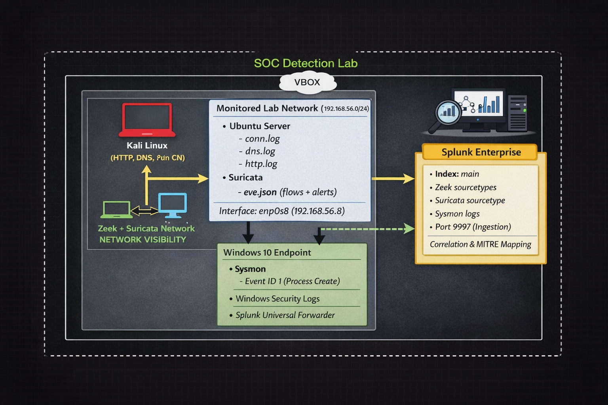

# 🛡️ SOC Detection Engineering Lab

**SOC-Detection-Engineering-Lab**

End-to-end SOC detection engineering lab correlating **network telemetry** (Zeek, Suricata) and **endpoint telemetry** (Sysmon, Windows Event Logs) in **Splunk** to detect reconnaissance and PowerShell-based defense evasion techniques mapped to **MITRE ATT&CK**.

---

## 👤 Author & Focus

**Author:** Solomon James  
**Target Role:** SOC Analyst / Detection Engineer  
**Primary Focus:** Network + Endpoint Telemetry Correlation  
**Frameworks:** MITRE ATT&CK, Detection Engineering Lifecycle  

---

## 📌 Overview

This repository documents an **end-to-end SOC Detection Engineering lab** designed to emulate how modern enterprise blue teams identify and investigate adversary behavior through **cross-sensor correlation**.

Rather than focusing solely on alert generation, this lab emphasizes the full detection engineering workflow, including:

- Signal generation and validation  
- Log quality and telemetry fidelity  
- Detection logic development  
- Cross-sensor correlation (network + endpoint)  
- MITRE ATT&CK–aligned detections  

This project is intentionally structured to reflect **real-world SOC operations**, not CTF-style exercises or isolated detections.

---

## 🎯 Objectives

- Build a realistic SOC lab with **multiple telemetry sources**
- Detect **reconnaissance** and **defense evasion** behaviors
- Correlate **endpoint and network activity** in Splunk
- Map detections to **MITRE ATT&CK techniques**
- Produce **resume- and interview-ready detection evidence**

---

## 🏗️ Architecture

### Core Components

- **Attack Host:** Kali Linux  
- **Endpoint:** Windows 10 (Sysmon + Windows Security Logs)  
- **Network Sensor:** Ubuntu Server (Zeek + Suricata)  
- **SIEM:** Splunk Enterprise  


### Telemetry Flow

Kali / Windows Activity
↓
Zeek / Suricata / Sysmon
↓
Splunk Indexers
↓
Detection Logic & Correlation


---

## 🧰 Tools & Technologies

### Network Telemetry
- **Zeek**
  - conn.log
  - dns.log
  - http.log

- **Suricata**

  - Flow events
  - Alert events

### Endpoint Telemetry

- **Sysmon**

  - Event ID 1 (Process Creation)

- **Windows Security Logs**

  - Event ID 4688 (Process Creation)

### SIEM & Analysis

- **Splunk Enterprise**
- **SPL (Search Processing Language)**

---

## 🧪 Detection Scenarios

### 1️⃣ Network Reconnaissance

**Techniques Detected**
- TCP SYN scanning
- Service enumeration
- Port scanning behavior

**Telemetry Sources**
- Zeek `conn.log`
- Suricata `flow` events

**Detection Strategy**

- High connection fan-out from a single source
- Short-lived TCP sessions
- Unusual destination port distribution

**MITRE ATT&CK Mapping**
- `T1046 – Network Service Scanning`

---

### 2️⃣ PowerShell Defense Evasion

#### Attack Simulation

```powershell

powershell.exe -nop -w hidden -c "Get-Process | Out-File C:\Users\Public\ps_test.txt"

```

Why This Matters

-nop bypasses PowerShell profiles

-w hidden suppresses user visibility

Common Living-off-the-Land Binary (LOLBin) abuse technique

Telemetry Sources
```
Sysmon Event ID 1

Windows Security Event ID 4688
```
Detection Strategy

Command-line argument inspection

Parent/child process analysis

Detection of hidden execution flags

MITRE ATT&CK Mapping

T1059.001 – PowerShell

TA0005 – Defense Evasion


🔍 Example Detection Logic (Splunk SPL)

```
index=main sourcetype=XmlWinEventLog:Microsoft-Windows-Sysmon/Operational EventCode=1
| search Image="*powershell.exe*" CommandLine="*-nop*"
| table _time host User Image CommandLine ParentImage
```

🔗 Cross-Sensor Correlation

A core objective of this lab is demonstrating correlation, not isolated alerts.

Examples include:

Identical source IPs observed across Zeek and Suricata

Endpoint PowerShell execution following prior network activity

Timeline reconstruction across multiple sensors

This mirrors how enterprise SOCs improve detection confidence and reduce false positives.

📁 Repository Structure
```
SOC-Detection-Engineering-Lab/
├── README.md
├── architecture/
│   └── soc_architecture_diagram.png
├── detections/
│   ├── network_recon.md
│   └── powershell_defense_evasion.md
├── screenshots/
│   ├── splunk_searches/
│   └── attack_execution/
└── notes/
```
🧠 Key Takeaways

Detection engineering prioritizes signal quality over alert volume

Correlating network and endpoint telemetry increases confidence

MITRE ATT&CK provides structure, not detections by itself

Strong detections require understanding attacker behavior and telemetry context

📜 License

This project is licensed under the MIT License.
